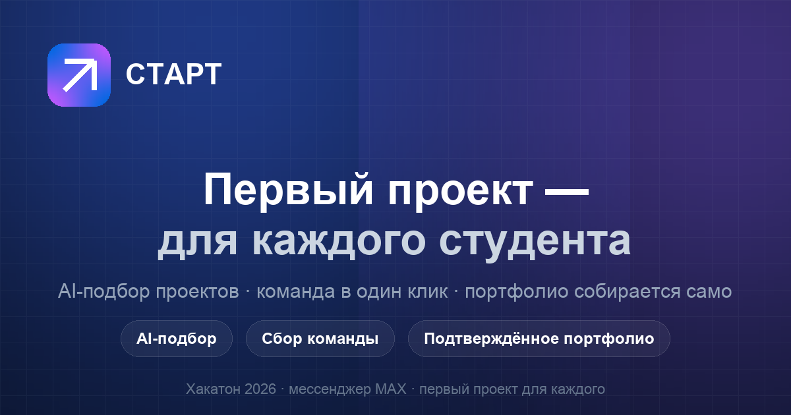
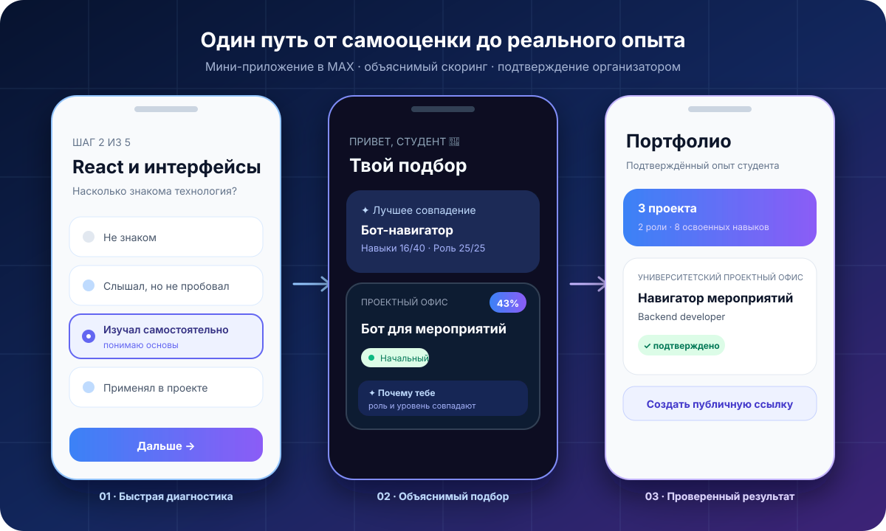
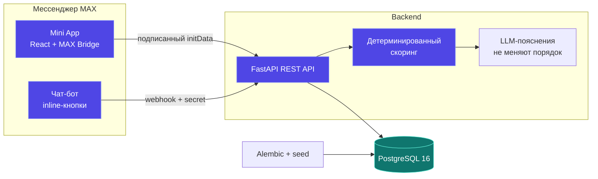

<div align="center">



<br />

[](https://github.com/Xesonar/project-start/actions/workflows/ci.yml)


### AI-подбор проектов, сбор команды и подтверждённое портфолио в MAX

[🎬 Сценарий за минуту](#-сценарий-за-60-секунд) · [🧪 Проверка решения](docs/submission.md) · [📖 API](openapi.json)

</div>

---

> **Проблема.** Студент 1–2 курса IT- или дизайн-направления без опыта хочет попасть на проект, но не знает, где
> их искать, не понимает, соответствует ли требованиям, и боится откликнуться.
> Организаторы проектов (вузовские офисы, студмедиа, акселераторы) не находят
> людей с нужными навыками. Итог — талантам не на чем расти, а проекты стоят.

> **Решение.** Старт — мини-приложение в мессенджере MAX, которое подбирает
> проекты под навыки и уровень студента, объясняет **почему**, помогает
> откликнуться на нужную роль, собрать команду и получить **подтверждённое**
> портфолио, которое не стыдно показать работодателю.

## 👀 Продукт одним взглядом

<p align="center">
  
</p>

<table>
  <tr>
    <td align="center"><strong>5 вопросов</strong><br/><sub>вместо длинной анкеты</sub></td>
    <td align="center"><strong>4 сигнала</strong><br/><sub>навыки, роль, направление, уровень</sub></td>
    <td align="center"><strong>1 понятный результат</strong><br/><sub>подходящий проект и объяснение</sub></td>
    <td align="center"><strong>0 выдуманных оценок</strong><br/><sub>AI объясняет, но не ранжирует</sub></td>
  </tr>
</table>

## ✨ Что внутри

| | Фича | Как это работает |
|---|---|---|
| 🎯 | **Объяснимый подбор проектов** | Быстрая диагностика по выбранной роли → детерминированный скоринг (навыки 40% · роль 25% · специализация 20% · уровень 15%) → LLM объясняет результат, не меняя порядок |
| 📊 | **Кольцо совпадения** | На каждом проекте — сколько процентов нужных навыков у тебя уже есть и что именно нужно подтянуть |
| 👥 | **Сбор команды** | Отклик идёт на конкретную роль со слотами, статус отслеживается, команда формируется в один клик |
| 💼 | **Портфолио** | Участие подтверждает организатор — это не «я сам написал», а верифицированный опыт |
| 🔗 | **Публичное портфолио** | Одна кнопка — ссылка на тёмную страницу-портфолио, которую можно отправить работодателю. Без контактов, только подтверждённый опыт |
| 💬 | **Бот в чате MAX** | Flow поиска и отклика прямо в чате; для сдачи требуется зарегистрировать webhook по инструкции |
| ✉️ | **Связь с организатором** | Сопроводительное сообщение, причина решения и персональные сообщения через бота без раскрытия контактов |
| 🔄 | **Управление участием** | Ожидающий отклик можно отменить; принятый участник отправляет организатору запрос на выход |
| 🗨️ | **Чат проекта** | У каждого проекта своя MAX-ссылка; принятый студент получает её через бота и на экране команды |
| ✅ | **Проверка результата** | Участник отправляет описание вклада и ссылку; организатор подтверждает работу или возвращает её с комментарием на доработку |
| 📈 | **Воронка пилота** | Админка показывает диагностики, отклики, принятия, завершения и подтверждения портфолио |
| 🛡 | **Админка организатора** | Управление заявками, формирование команды, связь через MAX, проверка работ и атомарное завершение проекта |

## 🎬 Локальный демо-режим

Перед запуском включите в локальном `.env`:

```env
DEMO_MODE=true
ALLOW_PRODUCTION_DEMO=true
```

На рабочем сервере оба флага должны быть `false`, чтобы анонимные посетители
не могли создавать заявки в настоящих проектах.

1. Запустите production Compose и откройте **http://127.0.0.1:18086** — попадёте на демо-лендинг.
2. Нажмите **«Открыть демо»** — войдёте как студент-первокурсник с заполненным
   профилем (JavaScript, HTML/CSS, React, Figma, Git, Python).
3. Дальше — всё как у настоящего студента: подбор, поиск, отклик, команда, портфолио.

Ссылка на чат-бота и Mini App публикуется после финальной регистрации webhook
в MAX. Mini App использует нативные BackButton, haptics и
шеринг MAX Bridge; весь продуктовый сценарий также доступен через web-демо.

**Админка:** `/admin`, пароль из `ADMIN_PASSWORD` (см. `.env.example`).

## 📱 Сценарий за 60 секунд

```
Лендинг → «Открыть демо» → готовый профиль демо-студента
   → Главная: «Твой подбор» + AI-объяснение «почему тебе»
   → Карточка проекта → общий матч 59%, отдельно видны покрытие и гэпы навыков
   → Отклик на роль → анимация успеха → вкладка «Отклики»
   → Команда → сдача личного результата → проверка организатором
   → Завершение проекта → Портфолио → публичная страница /p/<slug>
```

## 🏗 Архитектура



**Фронтенд:** React 18 + TypeScript + Vite + Tailwind, PWA, дизайн-система с
токенами, skeleton-загрузка, haptics, a11y (фокус-кольца, aria-pressed,
контрастные badge'и — цвет не единственный носитель информации).

**Бэкенд:** FastAPI + SQLAlchemy 2.0 + Pydantic v2 + PostgreSQL. Миграции
Alembic, сид-данные, JWT-авторизация, верификация подписи initData по
документации MAX, тесты на pytest.

**Инфраструктура:** Docker Compose, единый nginx-вход, Let's Encrypt,
автоматический apply миграций и сида при старте контейнера.

## 🚀 Запуск

```bash
cp .env.example .env          # заполнить JWT_SECRET, ADMIN_PASSWORD и нужные интеграции

docker compose -f docker-compose.prod.yml up -d --build

open http://127.0.0.1:18086          # приложение через production nginx
open http://127.0.0.1:18085/health   # healthcheck бэкенда
```

Такой запуск повторяет схему сдачи и использует нестандартные внешние порты,
поэтому не конфликтует с уже запущенными PostgreSQL и dev-серверами. Для
разработки с hot reload можно использовать обычный `docker compose up -d` и
адреса `:5173`/`:8000`.

Остановка и повторный запуск без потери данных:

```bash
docker compose -f docker-compose.prod.yml stop
docker compose -f docker-compose.prod.yml start
docker compose -f docker-compose.prod.yml down   # volume PostgreSQL сохраняется
```

`down -v` удалит демонстрационную БД и нужен только для намеренного полного
сброса. При следующем `up` backend снова применит миграции и идемпотентный seed.

### Окружение и внешние сервисы

Все параметры перечислены в `.env.example`. Обязательные для production:
`JWT_SECRET` (от 32 символов) и `ADMIN_PASSWORD` (от 8 символов). Для реального
MAX-сценария также нужны `MAX_BOT_TOKEN`, `MAX_BOT_WEBHOOK_SECRET` и публичный
HTTPS-адрес. `DEEPSEEK_API_KEY` необязателен: без него порядок рекомендаций и
основной сценарий продолжают работать, отключаются только короткие AI-пояснения.

Используемые порты: `18086` — единый web-вход, `18085` — backend для диагностики;
PostgreSQL в production-конфигурации наружу не публикуется. Версии Python- и
Node-зависимостей зафиксированы в `backend/requirements.txt` и
`frontend/package-lock.json`.

Seed-данные (6 организаций, справочник навыков, 12 открытых проектов и
демо-портфолио) синтетические. Они создаются автоматически и не имитируют
интеграцию с информационной системой вуза. Подробные тестовые роли, ожидаемое
поведение, пилот и ограничения приведены в [сценарии проверки](docs/submission.md).

Фронтенд и бэкенд отдельно:

```bash
cd frontend && npm install && npm run dev    # :5173
cd backend  && python -m venv .venv && .venv/bin/pip install -r requirements.txt
            && .venv/bin/uvicorn app.main:app --reload   # :8000
```

## 🧪 Тесты

```bash
cd backend && .venv/bin/pytest -q
cd frontend && npm run lint && npm test && npm run build
```

Тесты используют отдельную БД `project_start_test` (см. `docs/testing.md`) —
dev/demo база никогда не затирается.

## 📦 Комплект проверки

- [Пошаговый сценарий, тестовые данные, ограничения и пилот](docs/submission.md)
- [`openapi.json`](openapi.json) — зафиксированный контракт собственного API
- [`DATA-API.yaml`](DATA-API.yaml) — обязательные автоматизируемые проверки API
- `.env.example` — полный перечень переменных без рабочих секретов

Все организации, проекты, результаты и профили, создаваемые seed-скриптом,
являются **синтетическими демонстрационными данными**. Реальные интеграции MVP:
MAX Bot API/MAX Bridge и опциональный DeepSeek API для объяснений рекомендаций.

## 📁 Структура

```
frontend/src/
  screens/          # Экраны студента: Home, Catalog, ProjectDetail, Team, Portfolio...
  screens/admin/    # Админка
  components/       # ProjectCard, DifficultyBadge, MatchRing, BottomNav
  api/              # Типизированный REST-клиент
  lib/              # match.ts (скоринг навыков), haptics
  styles/           # Дизайн-система: токены, .card .btn-primary .chip .skeleton

backend/app/
  api/              # Роуты (auth, users, projects, applications, submissions, teams, portfolio, admin, bot)
  services/         # recommendation.py, ai_client.py, max_auth.py, applications.py
  models/  schemas/ seed/  alembic/
  bot/              # Экраны чат-бота (pure-функции, переиспользуют API-логику)
```

## 🗺 Roadmap

См. [docs/ROADMAP.md](docs/ROADMAP.md) — что добавлено, что в приоритете
(публичное портфолио по ссылке, геймификация, AI-ментор).

## 🛡 Безопасность

- Подпись `initData` проверяется на бэкенде, срок действия ограничен
- Вебхук бота защищён общим секретом (`X-Max-Bot-Api-Secret`)
- Повторные callback-события webhook отсекаются, публичные точки входа имеют rate limit
- JWT с настраиваемым сроком жизни, секрет из env
- Production-конфигурация не запускается с коротким JWT-секретом или стандартным паролем
- `/health` проверяет соединение с PostgreSQL, контейнеры имеют healthcheck
- Demo-режим по умолчанию выключен. В production он включается только парой
  `DEMO_MODE=true` и `ALLOW_PRODUCTION_DEMO=true`, чтобы его нельзя было
  случайно оставить открытым на рабочем сервере

## MAX: финальное подключение

1. В настройках созданного бота укажите публичный HTTPS-адрес развёрнутого приложения как URL Mini App.
2. Заполните `MAX_BOT_TOKEN` и сгенерированный `MAX_BOT_WEBHOOK_SECRET` в серверном `.env`.
3. Пересоберите backend и выполните `python -m app.bot.setup_webhook https://your-domain.example/api/bot/webhook` внутри контейнера.
4. На мобильном устройстве проверьте запуск кнопкой бота, возврат нативной кнопкой,
   тактильный отклик, отправку заявки и шеринг публичного портфолио.

При реальном запуске имя и фамилия приходят из подписанного `initData` MAX.
Webhook использует тот же `user_id` и обновляет профиль полями `first_name` и
`last_name`. Значение «Демо-студент» используется только в локальном demo-режиме.

## Известные ограничения MVP

- Каталог использует явно обозначенные синтетические данные; импорта из вузов пока нет.
- Организации задаются seed-скриптом, а проекты добавляются через админку.
- Один студент участвует максимум в трёх активных проектах; экран команды позволяет переключаться между ними, а завершённые проекты остаются в истории и портфолио.
- Автоматические напоминания и удаление профиля оставлены на этап реального пилота.
- До финальной регистрации webhook чат-бот MAX не считается подключённым, хотя его код и тесты готовы.
